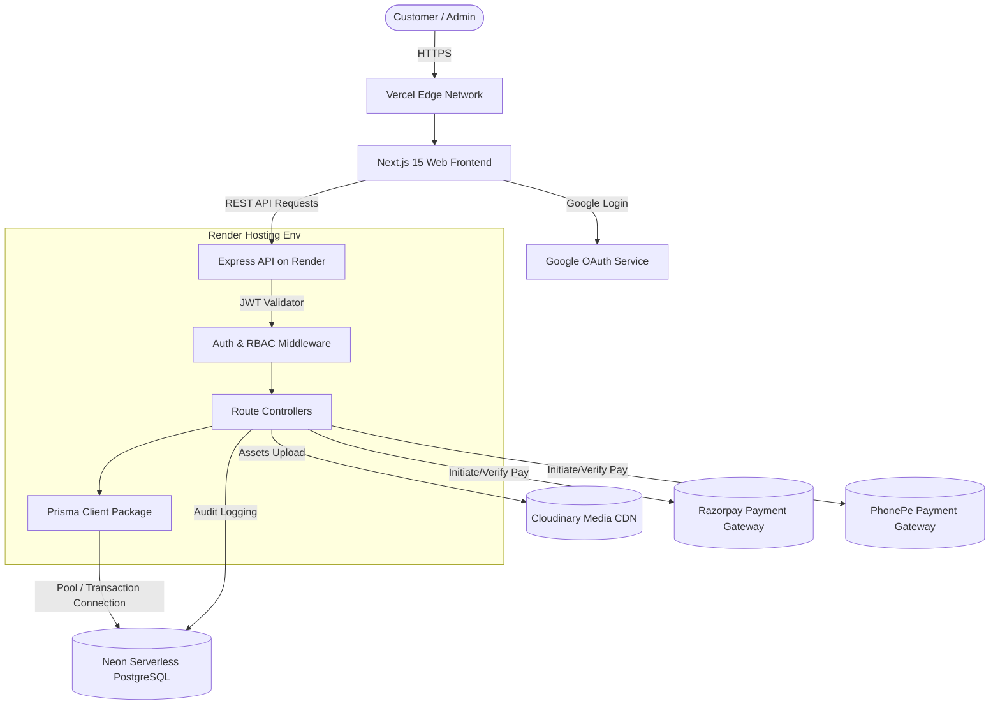

# System & Production Architecture - AlphaStryk

This document describes the high-level architecture, directory layout, network routing, and security structure for the AlphaStryk platform.

---

## 1. Production Architecture Diagram

The system follows a separated frontend (deployed on Vercel) and backend (deployed on Render) architecture. Data is stored in a serverless PostgreSQL instance on Neon, and static media files/3D models are stored in Cloudinary.



---

## 2. Directory Structure Layout

The project uses an **NPM Workspaces Monorepo** layout. This enables high modularity, shared TypeScript schemas, and isolated dependencies for frontend, API backend, and databases.

```text
alphastryk/
├── apps/
│   ├── web/                    # Next.js 15 Web App (Vercel Frontend)
│   │   ├── src/
│   │   │   ├── app/            # App Router setup (pages, routing, layouts)
│   │   │   ├── components/     # UI & Feature components (Shadcn + Tailwind)
│   │   │   ├── hooks/          # Custom React hooks (Framer Motion, 3D loader state)
│   │   │   └── lib/            # Next-specific utility packages
│   │   ├── package.json
│   │   └── tsconfig.json
│   │
│   └── api/                    # Express.js Backend API (Render Backend)
│       ├── src/
│       │   ├── controllers/    # API controllers containing logic
│       │   ├── middleware/     # Auth, RBAC, logging, rate limit middleware
│       │   ├── routes/         # Router declarations mapping endpoints
│       │   ├── services/       # Payment Gateways, Cloudinary, Email services
│       │   └── index.ts        # Server entry file
│       ├── package.json
│       └── tsconfig.json
│
├── packages/
│   ├── db/                     # Shared database ORM package
│   │   ├── prisma/
│   │   │   └── schema.prisma   # Master Prisma database models
│   │   ├── src/
│   │   │   └── index.ts        # Shared PrismaClient provider
│   │   └── package.json
│   │
│   └── common/                 # Common package shared across apps
│       ├── src/
│       │   └── index.ts        # Common Types, Enums, and Interfaces
│       └── package.json
│
├── docs/                       # System architecture and documentation
├── .env.example                # Shared environment properties blueprint
├── package.json                # Root monorepo workspace definition
└── tsconfig.json               # Root typescript configurations
```

---

## 3. API Architecture & Routing Conventions

The Express backend complies with standard REST principles. All data endpoints are prefixed with `/api/v1/`.

### Security Standards & Performance
1. **Security Headers**: Managed via `helmet` to mitigate Cross-Site Scripting (XSS) and Content Security Policy (CSP) vulnerabilities.
2. **CORS Setup**: Enforced with strict whitelist-based origins (accepting only requests from the Vercel frontend URL).
3. **Rate Limiting**: Configured using `express-rate-limit` to prevent brute-force attacks on authentication routes:
   - Auth routes: Max 10 requests per 15 minutes.
   - General API endpoints: Max 100 requests per minute.
4. **JSON Size Limits**: Restrict JSON parsing limits (e.g., max 10kb) to prevent Denial of Service (DoS) attacks via oversized payloads.

### Routing Layout
- `/api/v1/auth/`
  - `POST /register` - Register local user credentials.
  - `POST /login` - Login with credentials, issues JWT.
  - `POST /google` - Verify Google OAuth tokens and issue session JWT.
- `/api/v1/products/`
  - `GET /` - Public list active products (with pagination, category filtering).
  - `GET /:slug` - Retrieve detail for product & available variants.
  - `POST /` - (Admin/Super Admin only) Create product.
  - `PUT /:id` - (Admin/Super Admin only) Update product details.
- `/api/v1/checkout/`
  - `POST /cart` - Retrieve or sync local cart with user database account.
  - `POST /order` - Initialize order and calculate price adjustments (coupons, taxes).
  - `POST /payment/initiate` - Initiate gateway transaction (Razorpay / PhonePe).
  - `POST /payment/verify` - Verify webhook signatures or gateway payment status.
- `/api/v1/admin/`
  - `GET /audit-logs` - (Super Admin only) Retrieve audit logs.
  - `POST /coupons` - (Admin/Super Admin only) Manage discounts and usage.
  - `POST /refunds` - (Admin/Super Admin only) Process transaction refunds.

---

## 4. Authentication & RBAC Middleware Flow

Authentication is stateless and managed using signed JSON Web Tokens (JWT) inside HTTP-Only Secure cookies (or Authorization bearer headers).

```text
[HTTP Request] 
      │
      ▼
[Auth Middleware] ────► Verify JWT Signature ──(Fail)──► 401 Unauthorized
      │
      ▼ (Success: Attach user metadata to req.user)
[RBAC Middleware] ────► Check user.role matches Route requirements
      │
      ├──► Role: CUSTOMER    ──(Access general client routes)
      ├──► Role: ADMIN       ──(Access inventory, coupon, order routes)
      └──► Role: SUPER_ADMIN ──(Access refund permissions, audit logs)
      │
      ▼ (Authorized)
[Route Controller Handler]
```
