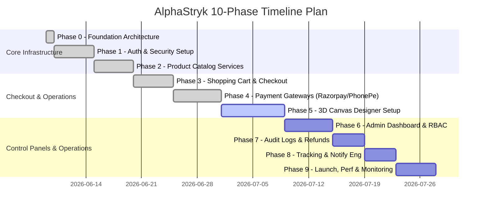

# Project Development Roadmap - AlphaStryk

This document outlines the complete 10-Phase Software Development Lifecycle (SDLC) for AlphaStryk, detailing the goals, core files, and completion requirements for each phase.

---

---

## Detailed Phase Breakdown

### Phase 0: Foundation, Workspace Init & Database Schema Design (Current Phase)
*   **Goal**: Establish scalable NPM workspaces folder structure, prisma schemas, type shares, and migration files.
*   **Deliverables**: Monorepo configs, `schema.prisma`, `packages/common` models, architecture specifications, and documentation maps.
*   **Status**: **COMPLETED**

### Phase 1: Authentication, Security & OAuth Integrations
*   **Goal**: Implement secure session management, credentials registrations, and OAuth authentications.
*   **Key Work**: Token signers, hash providers, Google OAuth token verifiers, and middleware guards.
*   **Status**: **COMPLETED**

### Phase 2: Category & Product Catalog Services
*   **Goal**: Develop the backend APIs and frontend product views to query, paginate, and show categories and variants.
*   **Key Work**: Catalog API routes, variant attribute mapping, pagination controllers, and dynamic slugs.
*   **Status**: **COMPLETED**

### Phase 3: Shopping Cart & Checkout Engine
*   **Goal**: Build persistent shopping carts syncing with databases and create calculations for orders.
*   **Key Work**: Cart sync APIs, order summary calculator, tax computations, and shipping calculations.
*   **Status**: **COMPLETED**

### Phase 4: Payment Gateways Integration (Razorpay & PhonePe)
*   **Goal**: Integrate gateway SDKs, handle checkout flows, and capture transactions with webhooks.
*   **Key Work**: Razorpay order generator, PhonePe checkout payload calculators, callback validators, and transaction logger.
*   **Status**: **COMPLETED**

### Phase 5: 3D Canvas Designer Engine
*   **Goal**: Build the 3D model customizer supporting textures, decals, and custom text inputs.
*   **Key Work**: React Three Fiber container, file uploaders, texture mapping controls, and layout state exporter.
*   **Status**: Pending

### Phase 6: Administration Dashboard & RBAC Operations
*   **Goal**: Build the secure portal for Admin and Super Admin roles to manage catalog, view sales, and update stocks.
*   **Key Work**: Role gate wrappers, inventory management routes, catalog editors, and orders viewer.
*   **Status**: Pending

### Phase 7: Audit Logging, Coupons & Refunds Operations
*   **Goal**: Implement admin audit log tracking, active coupon calculations, and payment refund processing.
*   **Key Work**: Audit log writing interceptor, Coupon schema checkers, and refund transaction initiators.
*   **Status**: Pending

### Phase 8: Order Tracking & Automated Notifications
*   **Goal**: Set up status tracking pipelines and send transactional updates via email.
*   **Key Work**: Carrier routing integrations, transactional mailers, status update templates.
*   **Status**: Pending

### Phase 9: Deployment, Performance Tuning & Launch Checklist
*   **Goal**: Establish production database branches, build pipeline releases, configure CORS security rules, and launch.
*   **Key Work**: Vercel deployment, Render scaling rules, performance load audits, and launch.
*   **Status**: Pending
