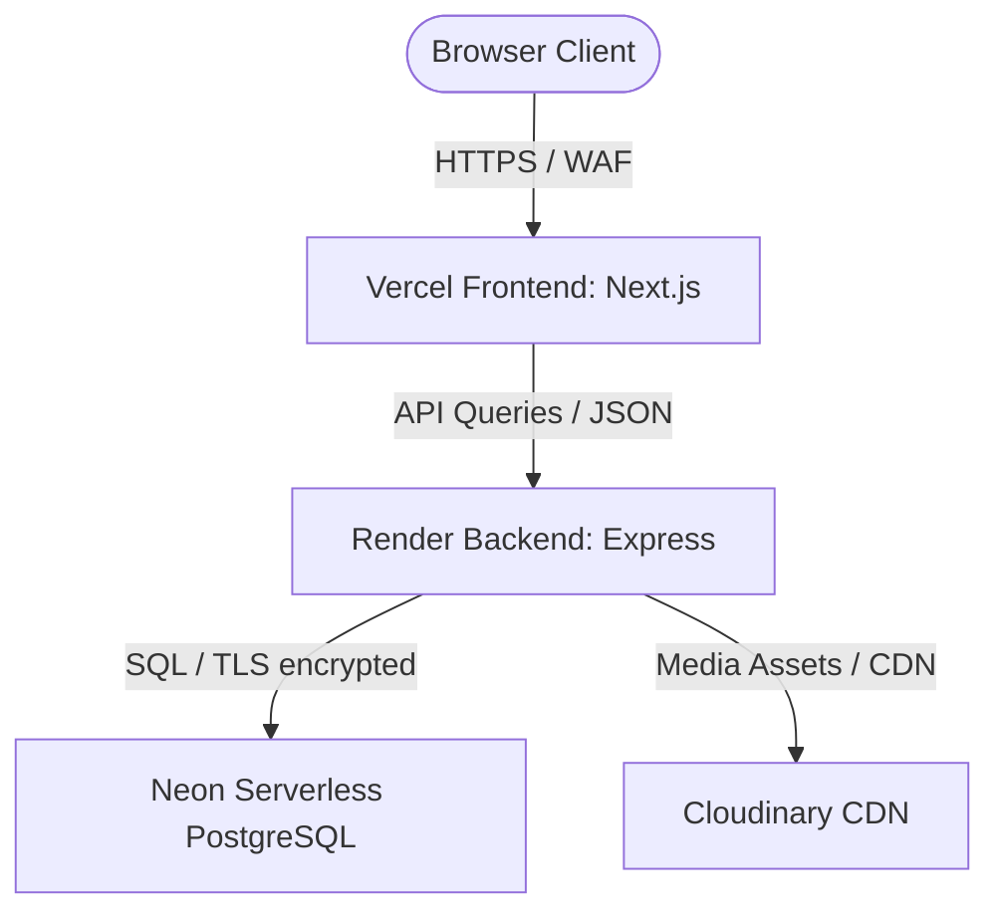

# AlphaStryk Production Deployment Checklist & Security Guide

This checklist provides standard procedures for secure deployment of AlphaStryk, aligned with OWASP security practices, automated backups, hosting configurations (Vercel, Render, Neon), and monitoring strategies.

---

## 1. OWASP Top 10 Security Checklist

### A. Injection & Input Validation (A03:2021)
- [ ] **Zod Payload Validation**: All public endpoints, especially authentication (/signup, /login, /forgot-password, /reset-password), must validate inputs using Zod. Check schemas in `apps/api/src/routes/auth.ts`.
- [ ] **ORM/Query Sanitization**: We use Prisma Client to interact with Neon PostgreSQL. Prisma automatically sanitizes parameters inside raw queries. Avoid string interpolation in `$queryRaw`.
- [ ] **File Upload Validation**: Ensure PNG/JPG customized designs uploaded to Cloudinary are strictly validated by size (max 5MB) and mime-type.

### B. Broken Authentication (A01:2021)
- [ ] **Rate Limiting**: Enforce two-tiered rate limiting:
  - Global API limiter: 100 requests per 15 minutes per IP (`apps/api/src/index.ts`).
  - Auth-sensitive routes limiter: 15 requests per 15 minutes for signups/logins, and 5 requests per hour for password resets (`apps/api/src/routes/auth.ts`).
- [ ] **Secure Cookies**: JWT auth cookies must be configured with:
  - `httpOnly: true` (prevents cross-site scripting/XSS cookie theft).
  - `secure: true` (ensures cookies are only sent over HTTPS).
  - `sameSite: 'lax'` or `'strict'` (mitigates cross-site request forgery/CSRF).

### C. Security Misconfiguration (A05:2021)
- [ ] **Helmet Headers**: Standardize HTTP headers to prevent security leaks using `helmet()` in `index.ts`:
  - `Content-Security-Policy` (CSP) limits script/style sources.
  - `Strict-Transport-Security` (HSTS) enforces browser HTTPS connections.
  - `X-Content-Type-Options: nosniff` prevents MIME sniffing.
  - `X-Frame-Options: DENY` blocks clickjacking.
- [ ] **CORS Verification**: Ensure cross-origin requests are limited strictly to the production domain (`https://alphastryk.com`) and local development URLs when `NODE_ENV !== 'production'`.
- [ ] **Stack Traces**: Ensure detailed error stack traces are hidden from API clients in production (`NODE_ENV === 'production'`).

### D. Sensitive Data Exposure (A02:2021)
- [ ] **Transport Layer Security**: Force HTTPS redirection globally at the DNS/CDN level (e.g., Cloudflare or Vercel routing).
- [ ] **Database Connection**: Always include `?sslmode=require` in Neon connection strings to encrypt transit data.

---

## 2. Infrastructure & Hosting Setup



### A. Vercel (Frontend Next.js App)
1. **Repository Link**: Select the `apps/web` root directory to deploy on Vercel.
2. **Build Settings**:
   - Build Command: `npx next build`
   - Output Directory: `.next`
3. **Environment Variables**:
   - `NEXT_PUBLIC_API_URL`: `https://api.alphastryk.com/api/v1`
   - `NEXTAUTH_SECRET`: Random 64-character token (`openssl rand -base64 48`).
   - `NEXTAUTH_URL`: `https://alphastryk.com`

### B. Render (Backend Express API)
1. **Deployment via blueprint**: The service automatically configures itself via [render.yaml](file:///C:/Users/sunny/.gemini/antigravity-ide/scratch/alphastryk/render.yaml).
2. **Environment Variables**:
   - `PORT`: `5000`
   - `NODE_ENV`: `production`
   - `DATABASE_URL`: Connection pool string from Neon dashboard.
   - `JWT_SECRET`: Random 32-character token.
   - `CLOUDINARY_CLOUD_NAME`, `CLOUDINARY_API_KEY`, `CLOUDINARY_API_SECRET`
   - `RAZORPAY_KEY_ID`, `RAZORPAY_KEY_SECRET`, `RAZORPAY_WEBHOOK_SECRET`
   - `PHONEPE_MERCHANT_ID`, `PHONEPE_SALT_KEY`, `PHONEPE_SALT_INDEX`
   - `RESEND_API_KEY`

### C. Neon PostgreSQL
1. **Connection Pooling**: Use the connection string with port `5432` or the transactional pooler connection string (which appends `-pooler` to host) for serverless environments.
2. **Migration Execution**:
   - Run migrations during build scripts on Render: `npx prisma db push --accept-data-loss` (or `npx prisma migrate deploy` if using migration directories).
3. **Automated Backups**: Verify nightly and weekly pg_dump runs as detailed in [database_backups.md](file:///C:/Users/sunny/.gemini/antigravity-ide/scratch/alphastryk/docs/database_backups.md).

---

## 3. Monitoring & Error Tracking

### A. Telemetry & Logs
- **Winston / Pino Logger**: Stream application errors to standard outputs (stdout/stderr) so Render or datadog can collect them automatically.
- **Audit Logging**: Ensure critical transactions (refunds, roles modifications, coupon adjustments) write events to the `AuditLog` table using standard service triggers.

### B. Sentry Integration (Optional but recommended)
Initialize Sentry in the Express API and Next.js projects to record unexpected run-time failures.

**Backend Setup (`apps/api/src/index.ts`)**:
```typescript
import * as Sentry from "@sentry/node";

if (process.env.NODE_ENV === 'production') {
  Sentry.init({
    dsn: process.env.SENTRY_DSN,
    tracesSampleRate: 1.0,
  });
  app.use(Sentry.Handlers.requestHandler());
}
```

---

## 4. Production Release Checklist

Before launching, execute this check:

| Step | Action Item | Verification Command / URL | Completed |
|------|-------------|----------------------------|-----------|
| 1 | Run all lint checks & TypeScript compiling | `npm run build:api && npm run build:web` | [ ] |
| 2 | Execute the test suites | `npm test` | [ ] |
| 3 | Confirm database migration is up to date | `npx prisma db push --schema=packages/db/prisma/schema.prisma` | [ ] |
| 4 | Audit npm vulnerabilities | `npm audit --audit-level=high` | [ ] |
| 5 | Verify `/health` endpoint returns 200 OK | `curl -i https://api.alphastryk.com/health` | [ ] |
| 6 | Verify Helmet headers are present in response | Check for `x-content-type-options: nosniff` | [ ] |
